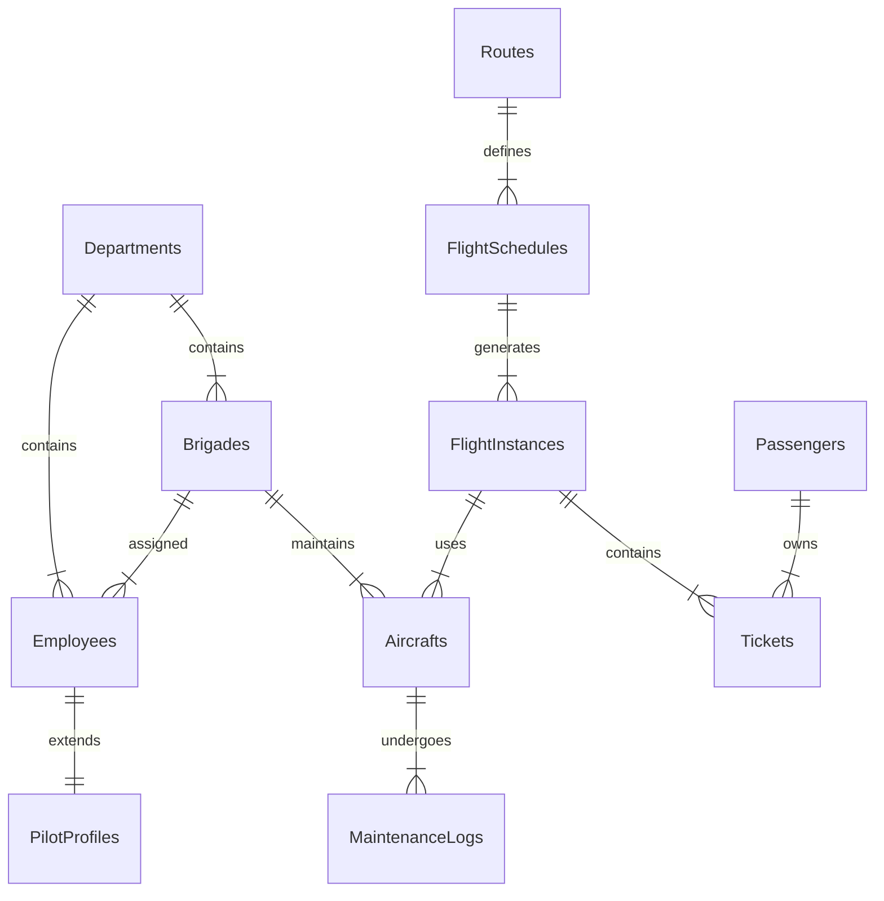

# Анализ предметной области

## Введение

**Тема:** Информационная система управления деятельностью аэропорта

**Название:** AeroFlow

**Планируемые внешние интеграции:** системы бронирования билетов (Amadeus, Sabre), метеорологические службы, таможенные службы, системы технического обслуживания самолётов

**Описание:** сервис представляет собой универсальный инструмент для управления всеми аспектами работы аэропорта. В отличие от существующих решений, ориентированных на отдельные функции, AeroFlow объединяет управление персоналом, самолётами, рейсами и пассажирами в едином пространстве, позволяя автоматизировать планирование, контроль и отчётность.

---

## Предметная область

### Целевая аудитория

Целевой аудиторией являются сотрудники аэропорта различных подразделений: пилоты, диспетчеры, техники, кассиры, работники службы безопасности, справочной службы и администрация.

Система также будет интересна пассажирам для отслеживания статуса рейсов, бронирования билетов и получения информации о расписании.

---

## Хранимые сущности

### Сущности и атрибуты

| Сущность | Атрибуты |
| --- | --- |
| Сотрудник | ФИО, дата рождения, пол, дата приёма, зарплата, количество детей |
| Должность | Название, тип (пилот, диспетчер, техник, кассир, охрана, справка, админ) |
| Отдел | Название, начальник |
| Бригада | Название, отдел |
| Самолёт | Бортовой номер, модель, дата поступления, вместимость |
| Техобслуживание | Тип, дата начала, дата окончания, налёт до ТО |
| Медосмотр | Дата, статус (прошёл/не прошёл), год |
| Маршрут | Пункт отправления, пункт назначения, пункт пересадки |
| Расписание | Тип самолёта, дни вылета, время вылета, время прилёта, базовая цена |
| Рейс | Дата, статус (запланирован/задержан/отменён), причина, самолёт |
| Пассажир | ФИО, паспорт внутренний, паспорт заграничный, дата рождения, пол |
| Билет | Цена, дата покупки, статус (забронирован/куплен/возвращён), место, багаж |
| Категория рейса | Название (внутренний, международный, чартерный, грузовой, специальный) |

---

## Особенности

- К каждому самолёту закрепляется бригада пилотов, техников и обслуживающего персонала.
- Пилоты обязаны проходить медосмотр каждый год; не прошедших необходимо переводить на другую работу.
- Самолёт должен своевременно осматриваться техниками и при необходимости ремонтироваться.
- Подготовка к рейсу включает техническую часть (техосмотр, заправка) и обслуживающую часть (уборка салона, запас продуктов).
- Цена билета зависит от маршрута и времени вылета (ночь, раннее утро — цена ниже).
- Авиарейсы могут быть задержаны (погода, технические неполадки) или отменены (не продан минимум билетов).
- На рейсы грузоперевозок и специальные рейсы билеты не продаются.
- Для спец. рейсов не существует расписания.
- Билеты на чартерные рейсы распространяет организовавшее их агентство.
- Пассажиры международных рейсов обязаны предъявить загранпаспорт и пройти таможенный досмотр.

---

## Проблема и текущее состояние

### Конкуренты

Существующие решения представляют собой в основном специализированные системы под отдельные функции аэропорта.

| Система | Описание | Сильные стороны | Слабые стороны |
| --- | --- | --- | --- |
| **SITA** | Глобальная система управления аэропортами | Огромный функционал, интеграция с авиакомпаниями | Дорогая, сложная в настройке, требует длительного внедрения |
| **Amadeus** | Система бронирования и управления рейсами | Надёжная, широкая база авиакомпаний | Ориентирована на авиакомпании, не на аэропорты |
| **AeroCloud** | Облачная платформа для аэропортов | Современный интерфейс, облачное хранение | Ограниченная поддержка в России, высокая стоимость |
| **1С:Аэропорт** | Отечественное решение | Поддержка российского законодательства, локализация | Устаревший интерфейс, ограниченный функционал |

### Существующие проблемы и недостатки

Основные требования к искомой системе следующие:

- Возможность управлять персоналом всех подразделений в одном месте.
- Возможность отслеживать состояние самолётов и график ТО.
- Расширенная система статусов рейсов (запланирован, задержан, отменён).
- Поддержка различных категорий рейсов с различной логикой обработки.
- Полноценная система учёта билетов и пассажиров.
- Автоматический контроль медосмотров пилотов.
- Гибкая система отчётности по всем сущностям.

Ни одна из найденных систем не удовлетворяет требования полностью в контексте российского аэропорта.

---

## Цель и задачи проекта

### Цель

Целью является проектирование и разработка информационной системы для комплексного управления деятельностью аэропорта.

### Основные задачи

1. Проанализировать предметную область.
2. Определить требования к проекту и сформировать техническое задание.
3. Спроектировать базу данных и архитектуру системы.
4. Разработать MVP с подключением сторонних интеграций.
5. Провести ручное и автоматизированное тестирование системы.
6. Написать пользовательскую документацию.
7. Ввести систему в эксплуатацию.

---

## Основные требования

### Функциональные требования

- Управление персоналом всех подразделений (пилоты, диспетчеры, техники, кассиры, охрана, справка, админ).
- Формирование бригад внутри отделов с закреплением за самолётами.
- Контроль медосмотров пилотов с автоматическим уведомлением о необходимости прохождения.
- Планирование и учёт технического обслуживания самолётов.
- Формирование расписания рейсов с указанием типа самолёта, маршрута, времени, цены.
- Управление статусами рейсов (запланирован, задержан, отменён, выполнен).
- Продажа и бронирование билетов с учётом динамического ценообразования.
- Возврат билетов до отправления рейса.
- Учёт пассажиров с разделением на внутренние и международные рейсы.
- Учёт багажа пассажиров.
- Формирование 13 видов отчётов по персоналу, самолётам, рейсам, билетам и пассажирам.
- Интеграция со сторонними системами (метеослужбы, таможенные службы).
- Импорт и экспорт данных.

### Нефункциональные требования

- Минималистичный дизайн интерфейса.
- Наличие веб-версии и мобильной версии системы.
- Хеширование паролей пользователей.
- Ролевая модель доступа (администратор, начальник отдела, рядовой сотрудник).
- Хранение документов в защищённом хранилище.
- Сбор метрик работы системы.
- Покрытие тестами критического функционала.
- Документация API.
- Поддержка русского и английского языков.
- Адаптивная вёрстка, мобильная версия в виде PWA.
- Резервное копирование данных ежедневно.
- Время отклика системы не более 2 секунд.

---

## Диаграмма связей (ERD)



---

## Примеры запросов к системе

| № | Описание запроса |
| --- | --- |
| 1 | Список работников по отделам, стажу, зарплате, полу, возрасту, детям |
| 2 | Работники в бригаде по отделам, обслуживающие конкретный рейс |
| 3 | Пилоты, прошедшие/не прошедшие медосмотр в указанный год |
| 4 | Самолёты, приписанные к аэропорту, находящиеся в нём в указанное время |
| 5 | Самолёты, прошедшие техосмотр за период, отправленные в ремонт |
| 6 | Рейсы по маршруту, длительности перелёта, цене билета |
| 7 | Отменённые рейсы по направлению, количеству невостребованных мест |
| 8 | Задержанные рейсы по причине, количество сданных билетов |
| 9 | Рейсы по типу самолёта, среднее количество проданных билетов |
| 10 | Авиарейсы категории в направлении с типом самолёта |
| 11 | Пассажиры на рейсе по дате, багажу, полу, возрасту |
| 12 | Свободные и забронированные места на рейсе по дате, маршруту, цене |
| 13 | Сданные билеты на рейс по дате, маршруту, цене, возрасту, полу |

---

## Архитектура системы

```
┌─────────────────────────────────────────────────────────────┐
│                    Клиентские приложения                    │
│  ┌─────────────┐  ┌─────────────┐  ┌─────────────────────┐  │
│  │   Веб-UI    │  │  Мобильное  │  │   Админ-панель      │  │
│  │   (React)   │  │  (PWA)      │  │   (Dashboard)       │  │
│  └─────────────┘  └─────────────┘  └─────────────────────┘  │
└─────────────────────────────────────────────────────────────┘
                            │
                            ▼
┌─────────────────────────────────────────────────────────────┐
│                      API Gateway                            │
│              (Auth, Rate Limiting, Routing)                 │
└─────────────────────────────────────────────────────────────┘
                            │
                            ▼
┌─────────────────────────────────────────────────────────────┐
│                    Микросервисы                             │
│  ┌──────────┐ ┌──────────┐ ┌──────────┐ ┌──────────────┐    │
│  │Персонал  │ │ Самолёты │ │  Рейсы   │ │   Билеты     │    │
│  │ Service  │ │ Service  │ │ Service  │ │   Service    │    │
│  └──────────┘ └──────────┘ └──────────┘ └──────────────┘    │
└─────────────────────────────────────────────────────────────┘
                            │
                            ▼
┌─────────────────────────────────────────────────────────────┐
│                    Хранилища данных                         │
│  ┌─────────────┐  ┌─────────────┐  ┌─────────────────────┐  │
│  │ PostgreSQL  │  │    Redis    │  │   S3 (документы)    │  │
│  │   (Основная │  │   (Кэш,     │  │   (Медосмотры,      │  │
│  │    БД)      │  │   сессии)   │  │    договоры)        │  │
│  └─────────────┘  └─────────────┘  └─────────────────────┘  │
└─────────────────────────────────────────────────────────────┘
```

---

## План внедрения

| Этап | Срок | Результат |
| --- | --- | --- |
| Анализ требований | 2 недели | Техническое задание |
| Проектирование БД | 2 недели | Схема базы данных |
| Разработка MVP | 8 недель | Рабочий прототип |
| Интеграции | 4 недели | Подключение внешних систем |
| Тестирование | 3 недели | Отчёт о тестировании |
| Документация | 2 недели | Пользовательские инструкции |
| Внедрение | 2 недели | Система в эксплуатации |

**Общий срок:** 23 недели (~6 месяцев)
