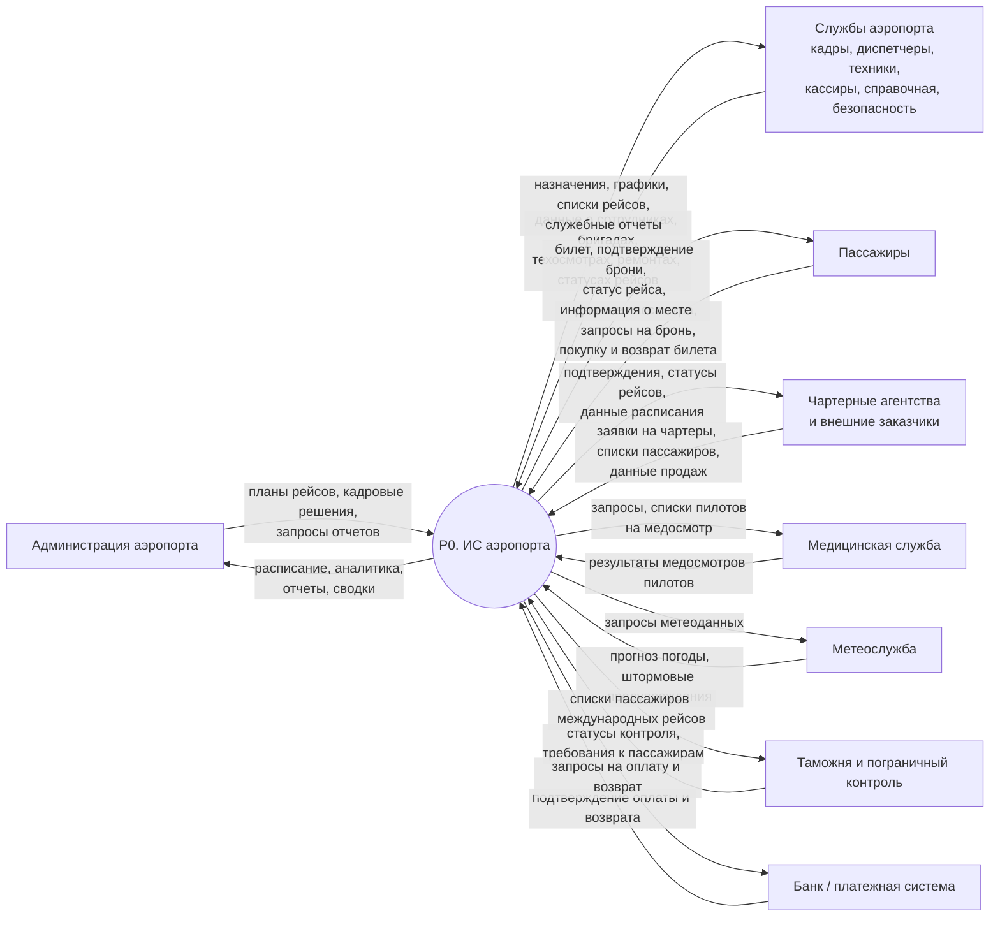

# Вариант 20. Проектирование информационной системы аэропорта

# Задание 1. Заинтересованные лица (стейкхолдеры)

## 1.1. Перечень стейкхолдеров

Ниже приведены основные заинтересованные стороны системы.

| Стейкхолдер | Интерес к системе | Цели | Влияние на проект | Возможные риски |
|---|---|---|---|---|
| **Администрация аэропорта** | Получение полной и актуальной картины по рейсам, персоналу, самолетам, загрузке рейсов | Планирование рейсов, расписания, кадрового состава, контроль эффективности и безопасности | **Очень высокое** | Частое изменение требований, расширение объема проекта, давление по срокам |
| **Начальники отделов** | Управление подчиненными, бригадами, загрузкой сотрудников | Получать актуальные данные по сотрудникам, назначать бригады, контролировать работу отдела | **Высокое** | Несогласованность требований разных отделов, неполный ввод данных |
| **Кадровая служба** | Ведение данных о сотрудниках | Учет стажа, зарплаты, состава семьи, принадлежности к отделу и бригаде, переводов | **Высокое** | Ошибки в персональных данных, утечка персональной информации |
| **Пилоты** | Доступ к информации о назначениях на рейсы и статусу медосмотра | Работать по актуальному графику, не допускать назначения без действующего медосмотра | **Среднее** | Сопротивление новым регламентам, конфликт из-за расписания, ошибки в данных медосмотра |
| **Диспетчеры** | Работа с расписанием и статусами рейсов | Оперативно фиксировать вылеты, прилеты, задержки и отмены | **Высокое** | Ошибки в статусе рейса, несвоевременное обновление данных |
| **Техническая служба** | Учет техосмотров, ремонтов, готовности самолетов | Контроль исправности самолетов, учет ремонтной истории | **Высокое** | Невнесение или запоздалое внесение данных о техническом состоянии |
| **Кассиры, служба бронирования, справочная служба** | Быстрый доступ к рейсам, местам, ценам и пассажирским данным | Продажа, бронь, возврат билетов, информирование пассажиров | **Среднее** | Ошибки бронирования, двойная продажа мест, перегрузка пользователей |
| **Служба безопасности аэропорта** | Контроль допуска пассажиров и багажа | Получать списки пассажиров, информацию о багаже и статусе посадки | **Среднее** | Несоответствие процедур, задержки при посадке |
| **Пассажиры** | Удобная покупка/бронь/возврат билета, получение информации о рейсе | Быстро купить билет, узнать расписание, пройти регистрацию и посадку | **Среднее** | Недовольство сервисом, ошибки в билетах, утечка персональных данных |
| **Чартерные агентства, внешние заказчики рейсов** | Получение информации по чартерным и специальным рейсам | Передавать заявки, списки пассажиров, получать подтверждения и статусы | **Среднее** | Ошибки интеграции, конфликт данных между агентством и аэропортом |
| **Медицинская служба** | Передача данных о медосмотрах пилотов | Своевременно вносить результаты медосмотров и ограничения по допуску | **Среднее** | Просрочка передачи результатов, неверный статус допуска пилота |
| **Таможенная и пограничная службы** | Доступ к данным по международным рейсам и пассажирам | Получать списки пассажиров и сведения для контроля | **Высокое** | Нарушение требований законодательства, ошибки в международных данных |
| **ИТ-служба / администраторы системы** | Надежность, безопасность и сопровождаемость системы | Поддерживать работоспособность, резервное копирование, права доступа | **Высокое** | Сбои, потеря данных, проблемы информационной безопасности |
| **Контролирующие органы** | Соответствие системы нормам авиационной, трудовой и информационной безопасности | Получать достоверную отчетность, контролировать соблюдение правил | **Высокое (косвенное)** | Штрафы, предписания, необходимость переделки системы под новые требования |

---

## 1.2. Вывод по стейкхолдерам

Ключевыми стейкхолдерами являются:

- администрация аэропорта;
- начальники отделов;
- диспетчерская и техническая службы;
- кадровая служба;
- кассово-бронированный контур;
- пассажиры;
- таможенные и пограничные органы;
- ИТ-служба.

Именно они формируют основные функциональные и нефункциональные требования к системе.

---

# Задание 2. Границы системы

## 2.1. Формализация границ системы

Граница проектируемой ИС проходит между:

- **информационной поддержкой процессов аэропорта** — это **входит** в систему;
- **физическим выполнением операций и внешними специализированными процедурами** — это **не входит** в систему.

Иными словами, система:

- **хранит и обрабатывает данные**;
- **поддерживает планирование, учет, контроль и отчетность**;
- **выдает пользователям информацию и документы**;
- но **не выполняет сама физические действия**: полет, ремонт, досмотр, медосмотр, заправку, уборку и т.д.

---

## 2.2. Что входит в систему

В состав системы входят следующие функции и объекты учета.

### 1. Кадровый учет
- справочник работников аэропорта;
- учет отделов, начальников отделов и бригад;
- учет пола, возраста, стажа, количества детей, заработной платы;
- хранение профессионально-специфических характеристик сотрудников;
- учет принадлежности работников к отделам и бригадам.

### 2. Учет пилотов и медосмотров
- хранение данных о прохождении ежегодного медосмотра;
- контроль допуска пилотов к полетам;
- формирование списков пилотов, прошедших/не прошедших медосмотр;
- уведомление о необходимости перевода пилота на другую работу при непрохождении медосмотра.

### 3. Учет самолетов
- регистрация самолетов, приписанных к аэропорту;
- учет типа самолета, возраста, числа выполненных рейсов;
- учет нахождения самолета в аэропорту в определенный момент времени;
- история прилетов/вылетов.

### 4. Технический учет
- учет техосмотров самолетов;
- учет ремонтов, дат и причин ремонта;
- учет числа ремонтов;
- учет количества рейсов до ремонта;
- фиксация технической готовности самолета к рейсу.

### 5. Планирование рейсов и расписание
- учет рейсов и маршрутов;
- классификация рейсов: внутренние, международные, чартерные, грузовые, специальные;
- хранение расписания: дни вылета, время вылета и прилета, маршрут, тип самолета;
- хранение стоимости билетов;
- учет особенностей:  
  - для специальных рейсов нет регулярного расписания;  
  - для грузовых и специальных рейсов билеты не продаются.

### 6. Продажа, бронирование и возврат билетов
- учет билетов на пассажирские рейсы;
- бронирование мест;
- продажа билетов;
- возврат билетов до отправления рейса;
- учет свободных и занятых мест;
- учет зависимости цены от маршрута и времени вылета;
- учет того, что билеты на чартер распространяются организовавшим их агентством.

### 7. Учет пассажиров и багажа
- регистрация пассажиров на рейс;
- учет документов пассажира;
- учет багажа;
- формирование списков пассажиров на рейс;
- отбор пассажиров по полу, возрасту, международному вылету и наличию багажа.

### 8. Учет статусов рейсов
- регистрация задержек рейсов;
- регистрация отмен рейсов;
- указание причин задержки или отмены;
- учет числа сданных билетов в период задержки;
- анализ невостребованных мест и процента незаполненности.

### 9. Отчетность и аналитика
- формирование всех запросов, указанных в условии задачи;
- расчет общего числа объектов по выбранным критериям;
- расчет средних и суммарных показателей;
- выборки по маршрутам, категориям рейсов, типам самолетов, периодам времени и т.д.

### 10. Администрирование и безопасность
- разграничение прав доступа;
- журналирование действий пользователей;
- защита персональных данных.

---

## 2.3. Что не входит в систему

Следующие процессы находятся **за пределами** системы.

### 1. Физическое выполнение полетов
- пилотирование самолета;
- управление воздушным движением в реальном времени;
- навигация и диспетчерское управление полетом как специализированная авиасистема.

### 2. Физическое техническое обслуживание
- фактический техосмотр;
- сам ремонт самолета;
- заправка топливом;
- уборка салона;
- загрузка питания и обслуживание самолета на перроне.

Система только **фиксирует факт, дату, результаты и статус** этих действий.

### 3. Медицинские процедуры
- проведение медосмотра;
- постановка диагноза;
- медицинское освидетельствование.

Система хранит только результат и статус допуска.

### 4. Досмотровые и контрольные процедуры
- фактический паспортный контроль;
- таможенный досмотр;
- физический досмотр багажа и пассажира.

Система может хранить статусы прохождения этих процедур, но не выполняет их.

### 5. Финансово-банковские операции
- фактическое списание денег;
- банковские возвраты;
- межбанковские расчеты.

Система формирует запросы на оплату/возврат и получает подтверждение.

### 6. Бухгалтерский и налоговый учет в полном объеме
- начисление заработной платы;
- налоговые расчеты;
- бухгалтерская отчетность.

В системе может храниться размер зарплаты как справочный показатель, но полноценная бухгалтерия не является ее основной функцией.

### 7. Внешняя деятельность агентств
- внутренняя CRM/ERP чартерных агентств;
- их собственные каналы продаж.

Система аэропорта только обменивается данными с такими системами.

---

## 2.4. Внешние системы, взаимодействующие с ИС аэропорта

| Внешняя система | Назначение взаимодействия |
|---|---|
| **Платежная система / банк** | Подтверждение оплаты и возврата билетов |
| **Системы чартерных агентств / агентские системы бронирования** | Получение заявок, списков пассажиров, сведений о продажах на чартерные рейсы |
| **Медицинская информационная система** | Передача результатов медосмотров пилотов |
| **Метеослужба** | Получение прогноза погоды и штормовых предупреждений для фиксации причин задержек |
| **Системы таможенного и пограничного контроля** | Передача списков пассажиров международных рейсов и получение статусов проверки |
| **Сервис уведомлений (SMS/e-mail)** | Оповещение пассажиров об изменении статуса рейса, брони, возврата |
| **Корпоративные системы аутентификации** *(при наличии)* | Единый вход пользователей и управление учетными записями |

---

## 2.5. Какие процессы можно и нужно автоматизировать

Ниже приведены процессы, которые целесообразно автоматизировать.

| Процесс | Степень автоматизации | Комментарий |
|---|---|---|
| Ведение справочников сотрудников, отделов, бригад | **Полная** | Формализуемый процесс с большим объемом данных |
| Учет медосмотров пилотов и контроль сроков | **Полная** | Возможны автоматические напоминания и блокировка допуска |
| Учет самолетов, их характеристик и истории рейсов | **Полная** | Базовый учетный контур |
| Учет техосмотров и ремонтов | **Полная** | Необходима история и контроль технической готовности |
| Планирование расписания рейсов | **Частичная** | Система формирует и проверяет варианты, решение утверждает администрация |
| Назначение бригад на рейсы | **Частичная** | Возможен автоматический подбор по правилам, но с подтверждением руководителя |
| Продажа, бронирование и возврат билетов | **Полная** | Один из основных автоматизируемых процессов |
| Учет мест на рейсах | **Полная** | Исключает двойные продажи и упрощает контроль загрузки |
| Учет пассажиров и багажа | **Полная / частичная** | Данные учитываются полностью, проверка документов выполняется человеком |
| Регистрация задержек и отмен рейсов | **Полная** | Система хранит причины, даты, статистику |
| Информирование пассажиров и служб | **Полная** | Через интерфейсы и уведомления |
| Формирование отчетов и выборок по запросам 1–13 | **Полная** | Полностью формализуемая аналитическая функция |
| Решение о переводе пилота, отмене рейса, отправке самолета в ремонт | **Частичная** | Система дает данные и сигналы, окончательное решение принимает ответственное лицо |

---

# Задание 3. Контекстная диаграмма (DFD уровень 0)

## 3.1. Контекстная диаграмма

На контекстном уровне система рассматривается как **один процесс**:  
**P0 — «Информационная система аэропорта»**.

### Диаграмма в формате Mermaid

---

## 3.2. Описание потоков данных

| Внешний актор | Потоки данных в систему | Потоки данных из системы |
|---|---|---|
| **Администрация аэропорта** | Планы рейсов, параметры расписания, кадровые решения, запросы отчетов | Отчеты, сводки, аналитика, расписание |
| **Службы аэропорта** | Данные о персонале, медосмотрах, техосмотрах, ремонтах, задержках, отменах, посадке, багаже | Назначения, рабочие списки, графики, служебная информация |
| **Пассажиры** | Данные для покупки/брони/возврата, сведения о багаже | Билеты, подтверждения, уведомления, информация о рейсе |
| **Чартерные агентства и внешние заказчики** | Заявки на рейсы, списки пассажиров, сведения о реализации мест | Подтверждения, статусы, данные о рейсе |
| **Медицинская служба** | Результаты медосмотров пилотов | Списки пилотов и запросы на медосмотр |
| **Метеослужба** | Погодные данные и предупреждения | Запросы на получение прогноза |
| **Таможня и пограничный контроль** | Статусы контроля, требования к международным рейсам | Списки пассажиров международных рейсов |
| **Банк / платежная система** | Подтверждение оплаты или возврата | Платежные запросы и запросы возврата |

---

