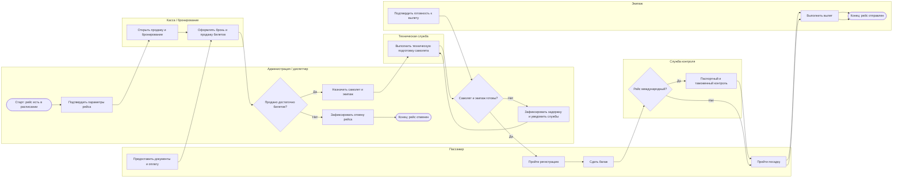
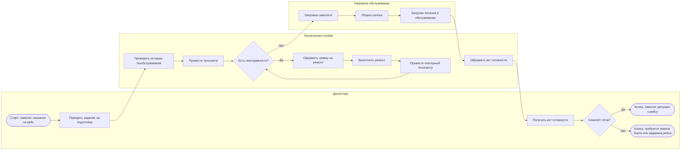

# Лабораторная работа №3  
## Бизнес-процессы предметной области (AS-IS)  
### Вариант 20. Информационная система аэропорта

## 1. Исходные допущения для модели AS-IS

Так как информационная система аэропорта только проектируется, модель **AS-IS** описывает текущее состояние работы аэропорта **до внедрения единой интегрированной ИС**.

Для текущего состояния предполагается, что:

- часть данных ведется в **бумажных журналах**;
- часть информации хранится в **разрозненных Excel-таблицах** или локальных базах отдельных служб;
- обмен информацией между подразделениями выполняется по **телефону, электронной почте, служебным запискам**;
- отсутствует единый источник достоверных данных по рейсам, пассажирам, самолетам, бригадам и техобслуживанию;
- многие действия зависят от ручной координации сотрудников.

В рамках работы в качестве ключевого рассматривается **процесс подготовки и выполнения пассажирского рейса**, так как он объединяет расписание, билеты, пассажиров, самолет, экипаж, техобслуживание и контроль вылета.

---

# Задание №1. Описание бизнес-процессов

## 1.1. Основной процесс системы

## Процесс 1. Подготовка и выполнение пассажирского авиарейса

### Почему этот процесс является ключевым
Этот процесс является центральным для предметной области, потому что именно вокруг рейса объединяются:

- расписание;
- продажа и бронирование билетов;
- назначение самолета;
- назначение экипажа;
- техническая подготовка борта;
- регистрация пассажиров и багажа;
- контроль посадки;
- фиксация вылета, задержки или отмены.

### Структура основного процесса
Основной процесс в текущем состоянии включает следующие этапы:

1. Подтверждение параметров рейса по расписанию.
2. Открытие продажи и бронирования билетов.
3. Накопление пассажирского спроса.
4. Проверка минимальной коммерческой загрузки рейса.
5. Назначение самолета и экипажа.
6. Проверка допуска пилотов.
7. Техническая подготовка самолета.
8. Регистрация пассажиров и багажа.
9. Прохождение контроля и посадка.
10. Вылет рейса либо фиксация задержки/отмены.

### Паспорт процесса

| Параметр | Описание |
|---|---|
| **Название процесса** | Подготовка и выполнение пассажирского авиарейса |
| **Цель процесса** | Обеспечить выполнение рейса по расписанию с готовым самолетом, экипажем, оформленными пассажирами и актуальным статусом рейса |
| **Инициатор** | Диспетчерская служба / администрация аэропорта на основании утвержденного расписания или заявки на рейс |
| **Входные данные** | Расписание рейсов, маршрут, тип самолета, доступные самолеты, данные о бригадах и пилотах, результаты медосмотров, сведения о техническом состоянии самолета, заявки пассажиров, данные о проданных и забронированных билетах, погодные условия |
| **Выходные данные** | Статус рейса (выполнен / задержан / отменен), список пассажиров, сведения о багаже, факт вылета, данные о занятии мест, служебные отчеты |
| **Участники** | Администрация аэропорта, диспетчер, кассир / служба бронирования, пассажир, техническая служба, наземное обслуживание, служба безопасности, таможня и пограничный контроль, экипаж |
| **Ожидаемый результат** | Рейс своевременно отправлен, либо при невозможности отправления его статус корректно зафиксирован, пассажиры и службы своевременно уведомлены |

---

## 1.2. Вспомогательные процессы

## Процесс 2. Продажа, бронирование и возврат билетов

Этот процесс поддерживает основной, так как обеспечивает формирование пассажиропотока на рейс.

| Параметр | Описание |
|---|---|
| **Название процесса** | Продажа, бронирование и возврат билетов |
| **Цель процесса** | Предоставить пассажиру возможность купить, забронировать или вернуть билет и актуализировать занятость мест на рейсе |
| **Инициатор** | Пассажир, кассир, чартерное агентство |
| **Входные данные** | Расписание, маршрут, дата вылета, тариф, наличие свободных мест, паспортные данные пассажира, данные об оплате |
| **Выходные данные** | Оформленный билет, бронь, запись о возврате, обновленные данные о занятых и свободных местах, кассовые документы |
| **Участники** | Пассажир, кассир, служба бронирования, чартерное агентство, платежная система / банк |
| **Ожидаемый результат** | Место на рейсе корректно зарезервировано или продано, либо билет корректно возвращен до вылета |

---

## Процесс 3. Техническая подготовка самолета к рейсу

Этот процесс является вспомогательным, но критически важным, так как от него зависит допуск самолета к рейсу. Одновременно он является **вложенным подпроцессом** основного процесса.

| Параметр | Описание |
|---|---|
| **Название процесса** | Техническая подготовка самолета к рейсу |
| **Цель процесса** | Проверить техническую исправность самолета, выполнить необходимое обслуживание и подтвердить готовность борта к вылету |
| **Инициатор** | Диспетчерская служба после назначения самолета на рейс |
| **Входные данные** | Данные о рейсе, назначенный борт, история техосмотров и ремонтов, требования по заправке, сведения о предыдущих неисправностях |
| **Выходные данные** | Акт готовности самолета, отметка о техосмотре, заявка на ремонт при необходимости, информация о задержке или замене самолета |
| **Участники** | Диспетчер, техническая служба, служба заправки, служба уборки / бортового обслуживания |
| **Ожидаемый результат** | Самолет подготовлен к рейсу и допущен к вылету либо выявлены неисправности и принято решение о ремонте, задержке или замене борта |

---

# Задание №2. BPMN-диаграммы

> Ниже приведены BPMN-сценарии в текстовом виде в формате Markdown.  
> Их можно перенести в **Draw.io, Bizagi Modeler, Camunda Modeler** или другой редактор и экспортировать в PDF.

---

## 2.1. BPMN-диаграмма основного процесса  
### «Подготовка и выполнение пассажирского авиарейса»

### Участники дорожек
- Администрация / диспетчер
- Касса / бронирование
- Пассажир
- Техническая служба
- Служба контроля
- Экипаж

### Логика процесса
1. Рейс подтверждается по расписанию.
2. Открывается продажа и бронирование билетов.
3. Пассажиры подают заявки и покупают билеты.
4. Перед вылетом проверяется минимальная загрузка рейса.
5. Если загрузка недостаточна — рейс отменяется.
6. Если загрузка достаточна — назначаются самолет и экипаж.
7. Проверяется допуск экипажа и техническая готовность самолета.
8. Если самолет не готов — рейс задерживается, проблема устраняется.
9. После готовности открывается регистрация пассажиров и багажа.
10. Для международного рейса выполняется паспортный и таможенный контроль.
11. Пассажиры проходят посадку.
12. Рейс отправляется.

### Диаграмма

---

## 2.2. BPMN-диаграмма вложенного процесса  
### «Техническая подготовка самолета к рейсу»

Этот подпроцесс входит в основной процесс и выполняется после назначения самолета на рейс.

### Участники дорожек
- Диспетчер
- Техническая служба
- Наземное обслуживание

### Логика подпроцесса
1. Диспетчер передает самолет в подготовку.
2. Техническая служба поднимает историю обслуживания.
3. Проводится техосмотр.
4. Если обнаружены неисправности — оформляется ремонт.
5. После ремонта проводится повторный техосмотр.
6. Если неисправностей нет — выполняется заправка, уборка, загрузка питания.
7. Оформляется акт готовности самолета.
8. Диспетчер получает подтверждение готовности.

### Диаграмма

---

# Задание №3. Анализ основного процесса AS-IS

## 3.1. Общий анализ

Основной процесс включает большое количество участников и пересекает несколько подразделений аэропорта. В состоянии **AS-IS** это приводит к следующим типовым проблемам:

- высокая зависимость от ручного обмена информацией;
- отсутствие единого актуального статуса рейса;
- повторный ввод одних и тех же данных;
- задержки из-за межслужебных согласований;
- высокий риск ошибок в данных о пассажирах, самолете, экипаже и рейсе.

---

## 3.2. Таблица проблем основного процесса

| Возможная проблема | Причина | Последствие |
|---|---|---|
| Нет единого источника данных по рейсу | Информация хранится в разных журналах, таблицах и локальных файлах служб | Возникают расхождения в статусе рейса, составе экипажа, списках пассажиров |
| Ручная проверка готовности самолета | Координация выполняется по телефону, на бумаге или через отдельные таблицы | Увеличивается время подготовки, возможны задержки вылета |
| Ручная проверка медосмотров пилотов | Данные медслужбы не связаны напрямую с расписанием и назначением экипажа | Возможен допуск пилота без актуального медосмотра или срочная замена экипажа |
| Повторный ввод данных пассажира | Паспортные данные вносятся при бронировании, продаже, регистрации и посадке отдельно | Ошибки в ФИО и документах, очереди, потеря времени |
| Несвоевременное обновление статуса рейса | Нет автоматического механизма синхронизации между диспетчером, кассой и справочной | Пассажиры получают устаревшую информацию, растет нагрузка на справочную службу |
| Дублирование операций по учету мест | Бронь, продажа и возвраты могут фиксироваться в разных каналах отдельно | Риск двойного бронирования, ошибки в количестве свободных мест |
| Позднее решение об отмене рейса при низкой загрузке | Нет оперативной аналитики по проданным билетам и порогу рентабельности | Лишние затраты на подготовку рейса, массовые возвраты, недовольство пассажиров |
| Задержка в обработке данных по чартерным рейсам | Списки пассажиров и данные продаж поступают от агентств вручную или с опозданием | Некорректные пассажирские списки, проблемы при регистрации и посадке |
| Избыточная зависимость от человеческого фактора | Ключевая информация передается устно или вручную подтверждается ответственными лицами | Повышается вероятность пропуска ошибок и несогласованности действий служб |
| Ручной учет багажа | Сведения о багаже фиксируются отдельно от данных по пассажиру и рейсу | Ошибки в багажных ведомостях, задержки при регистрации и выдаче багажа |
| Узкое место на этапе регистрации и контроля | Проверка документов, багажа и посадки выполняется последовательно и вручную | Очереди, опоздания пассажиров на посадку, рост нагрузки на персонал |
| Дублирование технической информации | Результаты техосмотра и ремонта могут вестись параллельно в бумажном журнале и электронной таблице | Несоответствие истории обслуживания самолета, риск неверного решения о допуске |
| Отсутствие автоматических уведомлений пассажиров | Информация о задержке или отмене сообщается через кассу, справочную или табло с задержкой | Пассажиры поздно узнают об изменениях, увеличивается число обращений и конфликтных ситуаций |
| Сложность контроля бригад и распределения работников | Информация по отделам, бригадам и назначениям не централизована | Ошибки в назначении персонала, перегрузка одних работников и недозагрузка других |

---

# Итог

В текущем состоянии (**AS-IS**) для предметной области аэропорта можно выделить:

- **основной процесс** — подготовка и выполнение пассажирского авиарейса;
- **вспомогательный процесс 1** — продажа, бронирование и возврат билетов;
- **вспомогательный процесс 2** — техническая подготовка самолета к рейсу.

Проведенный анализ показал, что основными недостатками текущего состояния являются:

- разрозненность данных;
- ручные операции;
- дублирование ввода;
- задержки согласований между службами;
- высокий риск ошибок и несвоевременного информирования.

Это подтверждает необходимость внедрения единой информационной системы аэропорта, которая должна автоматизировать учет рейсов, персонала, самолетов, пассажиров, билетов, техосмотров и статусов рейсов.

---
