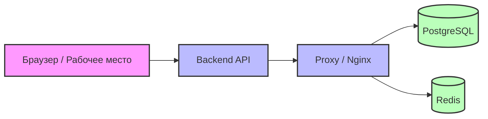
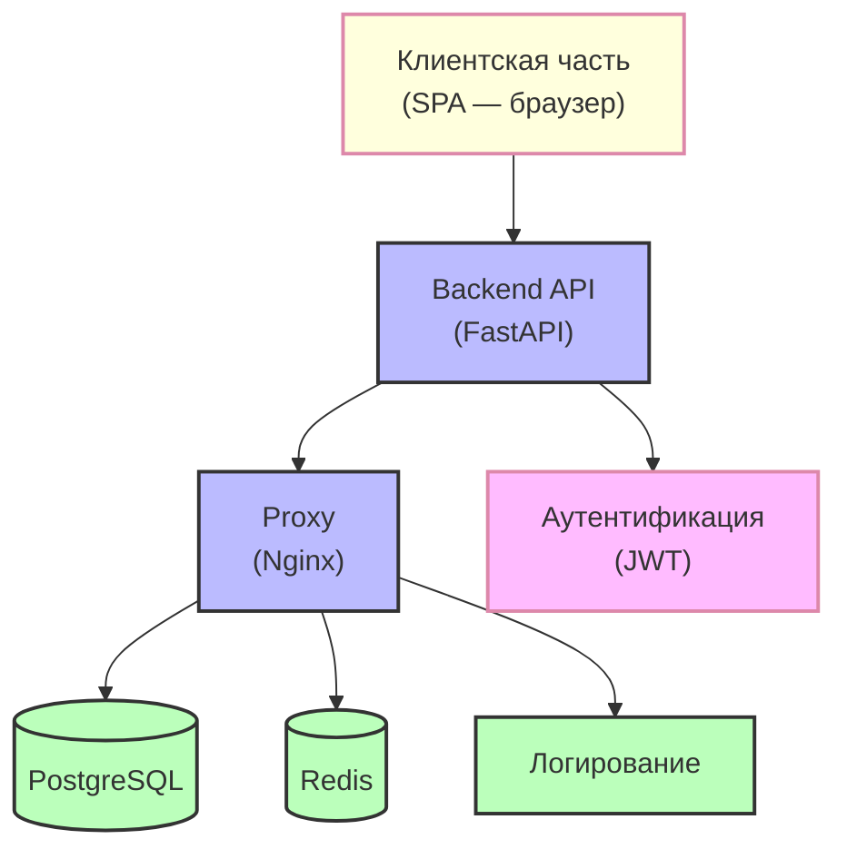
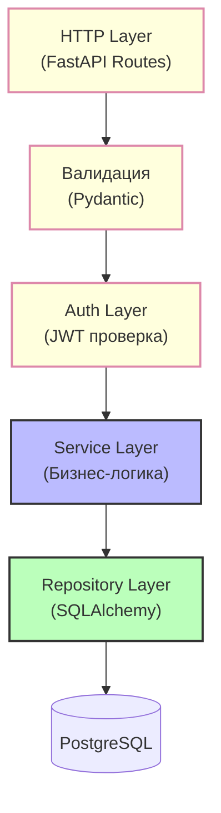

# Лабораторная работа №8. Проектирование архитектуры информационной системы AirPortIS

---

## Раздел 1 — Выбор архитектурного стиля

### Выбранный стиль: Клиент–сервер (трёхзвенная веб-архитектура)

### Верхнеуровневая схема системы

### Обоснование выбора

#### 1. Почему клиент–сервер подходит для AirPortIS

Предметная область предполагает **множество ролей** с разными правами доступа:

- Администрация аэропорта — планирование рейсов, формирование кадрового состава, отчётность
- Диспетчеры — управление расписанием, статусами рейсов
- Пилоты — просмотр назначений, подтверждение готовности, проверка меддопусков
- Техническая служба — учёт техосмотров и ремонтов самолётов
- Кассиры — продажа и бронирование билетов
- Служба безопасности — контроль документов пассажиров

Всем им нужен **единый источник истины**. Клиент–серверная архитектура позволяет:

- Вынести бизнес-логику на сервер: проверка меддопусков пилотов, валидация документов, правила продажи билетов (минимум N билетов для вылета, загранпаспорт для международных рейсов)
- Обеспечить централизованное хранение данных о рейсах, самолётах, экипажах, пассажирах
- Поддерживать все 13 типов аналитических запросов из ТЗ
- Гарантировать консистентность данных при одновременной работе множества пользователей

#### 2. Почему отказался от альтернатив

**Монолит (толстый клиент / десктопное приложение):**

- Не подходит, так как системе нужен **кроссплатформенный доступ**: диспетчеры работают с нескольких рабочих станций, кассиры — на кассовых терминалах, лётный состав — с различных устройств
- Проблемы с **синхронизацией данных**: при изменении статуса рейса (задержка, отмена) все клиенты должны мгновенно получить обновление
- Сложность **централизованных обновлений**: при изменении правил продажи билетов придётся обновлять каждое рабочее место

**Микросервисы:**

- **Overengineering** для данного масштаба: команда 1–3 человека, нагрузка умеренная
- **Сильная связанность домена**: рейс ↔ маршрут ↔ самолёт ↔ экипаж ↔ пассажиры ↔ багаж ↔ медосмотр. Разделение потребует распределённых транзакций и sagas
- **Избыточная сложность**: для учебного проекта микросервисы только замедлят разработку

#### 3. Минусы клиент–серверной архитектуры и стратегии работы с ними

| Минус | Стратегия минимизации |
|-------|----------------------|
| **Единая точка отказа backend** | Stateless-архитектура, health-checks, автоматический рестарт через systemd/docker, регулярные бэкапы БД |
| **Рост монолита усложняет поддержку** | Строгая модульная структура (разделение по доменам: personnel, flights, passengers, aircraft), CI/CD с автотестами |
| **Пиковые нагрузки при массовой продаже билетов** | Redis-кеширование справочников и расписания, connection pooling в БД |

**Условия перехода на микросервисы:**

Переход целесообразен при:

- **DAU > 20 000** — расширение на несколько аэропортов
- **Появлении автономного режима** — в мобильных приложениях для работы экипажей
- **Необходимости независимого масштабирования** — модуля продажи билетов в сезон отпусков
- **Интеграции с внешними системами** — авиакомпании, погодные сервисы, платёжные шлюзы через event-driven архитектуру

---

## Раздел 2 — Компоненты системы

### Детальная архитектурная схема

### Описание компонентов

| Компонент | Что делает | Почему нужен именно в AirPortIS |
|-----------|------------|--------------------------------|
| **Клиент (SPA)** | Отображает интерфейсы для разных ролей (администрация, диспетчеры, кассиры, пилоты, техники), отправляет REST-запросы, кеширует статику | Диспетчерам и кассирам нужен доступ с рабочих станций. SPA обеспечивает реактивность при работе с расписанием рейсов и таблицами продаж без перезагрузки страницы |
| **Backend API (FastAPI)** | Принимает запросы, валидирует данные, выполняет бизнес-логику: проверка меддопусков пилотов, расчёт стоимости билетов (ночное время дешевле), валидация документов, правила продажи | Вся логика из ТЗ должна исполняться централизованно: минимум билетов для вылета, проверка загранпаспорта для международных рейсов, расчёт цены по времени вылета. Без централизации возникнут аномалии данных |
| **Nginx (Proxy)** | Reverse proxy, SSL-терминация, отдача статики, rate limiting | Защита backend от перегрузки при пиковых продажах билетов, единая точка входа для всех клиентов |
| **PostgreSQL** | Хранит все сущности: работники, бригады, отделы, самолёты, рейсы, маршруты, пассажиры, билеты, багаж, медосмотры, техосмотры | Данные **строго реляционные** с множеством связей: рейс ↔ маршрут, самолёт ↔ бригада (M:N), билет ↔ рейс ↔ пассажир. Нужны **транзакции (ACID)** при продаже билетов и регистрации на рейс |
| **Redis** | Кеш расписания рейсов, справочников (категории, типы самолётов), аналитических отчётов | Кассиры многократно запрашивают одни и те же данные: расписание, свободные места, цены. Без кеша БД будет перегружена. Кешируем READ-операции с TTL, инвалидируем при изменении данных |
| **JWT (Аутентификация)** | Выдаёт токены, проверяет роли: администрация, диспетчер, пилот, техник, кассир, служба безопасности | 7 категорий пользователей с разными правами доступа. Кассир не должен видеть кадровые данные пилотов, пилот не должен отменять рейсы |
| **Логирование** | Журналирование действий пользователей (кто, когда, что изменил) | Требование из ТЗ: «журналирование действий пользователей». При отмене рейса или возврате билета необходимо знать, кто это сделал |

### Почему не добавлены другие компоненты

| Компонент | Почему не нужен |
|-----------|----------------|
| **Брокер сообщений (RabbitMQ/Kafka)** | Все процессы в AirPortIS **синхронные**: продажа билета → проверка наличия мест → подтверждение. Асинхронность потребуется только при внедрении email-рассылок или генерации PDF-отчётов |
| **CDN** | Система используется в пределах одного аэропорта, статика не требует глобальной доставки. Nginx справляется с отдачей статики |
| **Read Replica БД** | Нагрузка умеренная, один экземпляр PostgreSQL справится. Read-реплика нужна при значительном росте аналитических запросов |
| **Elasticsearch** | Полнотекстовый поиск не требуется. Достаточно LIKE-запросов в PostgreSQL для поиска пассажиров по ФИО |

---

## Раздел 3 — Оценка нагрузки

### Исходные данные (реалистичные для среднего регионального аэропорта)

| Параметр | Значение | Обоснование |
|----------|---------|-------------|
| **Отделов** | ~15 | Лётная служба, диспетчерская, техническая, кадровая, кассовая, служба безопасности, справочная и др. |
| **Работников** | ~500 | Штат среднего регионального аэропорта |
| **Бригад** | ~30 | Бригады пилотов, техников, обслуживающего персонала |
| **Самолётов** | ~20 | Приписаны к аэропорту |
| **Рейсов в день** | ~50 | Вылеты и прилёты |
| **Пассажиров в день** | ~2 000 | Средняя загрузка рейсов |

### 1. DAU (Daily Active Users) с разбивкой по ролям

| Роль | Всего | Активность | DAU |
|------|-------|------------|-----|
| **Диспетчеры** | 30 | 100% в сменах | 30 |
| **Лётный состав (пилоты)** | 50 | 40% в сменах | 20 |
| **Технический персонал** | 80 | 60% в сменах | 48 |
| **Кассиры** | 20 | 100% в рабочие часы | 20 |
| **Администрация** | 50 | 80% в рабочие часы | 40 |
| **Служба безопасности** | 40 | 100% в сменах | 40 |
| **Справочная служба** | 15 | 100% в рабочие часы | 15 |
| **Итого DAU** | | | **≈ 215** |

### 2. Действия на пользователя в день (Read / Write)

| Роль | Чтение (запросов/день) | Запись (запросов/день) | Примеры |
|------|------------------------|------------------------|---------|
| **Диспетчер** | 15 (расписание, статусы рейсов, свободные самолёты) | 10 (изменение статусов, задержки, отмены) | Управление вылетами |
| **Пилот** | 5 (назначения, расписание) | 1 (подтверждение готовности) | Просмотр и подтверждение |
| **Техник** | 8 (список самолётов, задания) | 5 (фиксация осмотров, ремонтов) | Внесение результатов техосмотра |
| **Кассир** | 10 (рейсы, наличие мест, цены) | 15 (продажа билетов, возвраты) | Оформление билетов |
| **Администрация** | 20 (аналитические отчёты, кадровые данные) | 5 (планирование, кадровые операции) | 13 типов запросов из ТЗ |
| **Служба безопасности** | 10 (рейсы, пассажиры) | 2 (пометки о досмотрах) | Проверка документов |
| **Справочная** | 5 (расписание, статусы) | 1 (помощь пассажирам) | Справки |

**Средневзвешенная нагрузка:**

- **Read:** (30×15 + 20×5 + 48×8 + 20×10 + 40×20 + 40×10 + 15×5) = 1 869 / 215 ≈ **9** запросов/DAU
- **Write:** (30×10 + 20×1 + 48×5 + 20×15 + 40×5 + 40×2 + 15×1) = 1 195 / 215 ≈ **6** запросов/DAU

### 3. RPS (Requests Per Second) — расчёт

**За день:**

- Read: 215 × 9 = **1 935** запросов
- Write: 215 × 6 = **1 290** запросов

**Активные часы:** 18 часов (круглосуточный режим аэропорта) = 64 800 секунд

| Тип | Средний RPS | Пиковый RPS (×3) | Характер нагрузки |
|-----|-------------|------------------|-------------------|
| **Read** | 1 935 / 64 800 ≈ **0.03** | **~0.1 RPS** | Лёгкие SELECT, часто с кешем Redis |
| **Write** | 1 290 / 64 800 ≈ **0.02** | **~0.06 RPS** | Транзакции с валидацией (продажа билета, техосмотр) |

**Ключевой вывод:** 60% нагрузки — чтение, 40% — запись. Это определяет стратегию: **кеширование** расписания и справочников + **строгая консистентность** при записи (транзакции).

### 4. Объём данных

| Тип | Размер | Расчёт | Итого/год |
|-----|--------|--------|-----------|
| Работники | ~500 × 2 KB | | ~1 MB |
| Самолёты | ~20 × 2 KB | | ~40 KB |
| Рейсы (архив) | ~50 × 365 × 2 KB | | ~36.5 MB |
| Билеты | ~730 000 × 1 KB | 2 000 пассажиров × 365 дней | ~730 MB |
| Медосмотры | ~50 × 12 × 1 KB | | ~600 KB |
| Техосмотры | ~20 × 100 × 1 KB | | ~2 MB |
| **Итого «чистых» данных** | | | **~800 MB** (без учёта истории и индексов) |

**Генерация данных в день:** ~12 MB/день → ~3 GB/год + индексы и бэкапы → ~10 ГБ/год с запасом

### 5. Вывод по масштабированию

**Read-нагрузка (0.1 RPS пик):**

- Легко покрывается **одним экземпляром API + Redis** (TTL для расписания)
- PostgreSQL справляется с тысячами SELECT/сек

**Write-нагрузка (0.06 RPS пик):**

- Один сервер PostgreSQL справляется с запасом (транзакции короткие <50 мс)
- Конфликты редки (разные кассиры → разные рейсы)

**Горизонтальное масштабирование НЕ требуется.** Достаточно:

- **Вертикального резерва:** 2 vCPU / 4 GB RAM (с запасом на рост)
- **Read-реплики БД** — только если время отклика отчётов >2 сек
- **Шардирования** — при расширении на сеть аэропортов

**Достаточно одного сервера** (или VPS) с Docker Compose для развёртывания всех компонентов.

---

## Раздел 4 — Выбор стека технологий

| Слой | Что выбрано | Обоснование | Альтернатива и причина отказа |
|------|-------------|-------------|-------------------------------|
| **Бэкенд** | **Python + FastAPI** | Async I/O критичен для одновременной обработки запросов от множества пользователей в период продажи билетов. Pydantic обеспечивает строгую валидацию данных: проверка дат, валидация паспортных данных, контроль меддопусков пилотов. Автоматическая генерация OpenAPI упрощает интеграцию с фронтендом. Быстрая разработка: для учебной команды 1–3 человека скорость важнее микрооптимизаций | Java/Spring Boot: избыточная сложность, тяжёлый memory footprint. Node.js/Express: слабая типизация без TypeScript, сложнее валидировать доменные правила. Django: overkill, тяжелее FastAPI |
| **База данных** | **PostgreSQL 15+** | Реляционная модель идеально подходит для связанных сущностей: рейс ↔ маршрут ↔ самолёт ↔ экипаж ↔ билет. ACID-транзакции критичны при продаже билетов (проверка мест → блокировка → запись). Row-level security для разграничения доступа: кассир видит только свои операции, администрация — все | MySQL: хорошая альтернатива, но меньше возможностей для расширений. MongoDB/NoSQL: непригодна для строго связанных сущностей с ACID-требованиями. SQLite: не подходит для многопользовательского режима |
| **Фронтенд** | **Vue 3 + Vite + Element Plus** | Компонентная модель удобна для дашбордов диспетчеров, таблиц рейсов и форм продажи билетов. Vite даёт быстрый HMR при разработке. Element Plus предоставляет готовые UI-компоненты: таблицы с пагинацией, формы валидации, календари для расписания — экономит время разработки | React: крутая кривая обучения, тяжелее бандл для данного масштаба. Angular: overkill, сложная настройка для учебной ИС. Чистый HTML/JS: не масштабируется, сложно поддерживать |
| **Кеш** | **Redis 7** | Кеширование расписания рейсов и справочников (категории, типы самолётов). TTL для отчётов, инвалидация по событиям: `flight_updated`, `ticket_sold`. Хранение сессий пользователей (JWT blacklist). Pub/Sub для будущих уведомлений (изменение статуса рейса) | Memcached: нет поддержки структур данных (hashes, sorted sets), сложнее управлять TTL. Встроенный кеш PostgreSQL: недостаточно гибкий |
| **Веб-сервер** | **Nginx** | Reverse proxy для защиты backend API. SSL-терминация (HTTPS). Отдача статики фронтенда (кеширование JS/CSS). Rate limiting для защиты при массовой продаже билетов | Apache: тяжелее, сложнее конфигурация. Только FastAPI: нет встроенной отдачи статики и SSL |
| **Контейнеризация** | **Docker + Docker Compose** | Единая конфигурация для разработки и продакшена. Быстрое развёртывание: `docker-compose up` — и система работает. Изоляция зависимостей: Python, PostgreSQL, Redis в отдельных контейнерах | Vagrant: тяжелее, медленнее запуск. Bare metal: сложно переносить между серверами |

---

## Раздел 5 — Архитектура кода

### Слоёная архитектура бэкенда

### Описание слоёв и модулей

**HTTP Layer (Routes):**

- Принимает HTTP-запросы от клиентов
- Вызывает валидацию входных данных
- Возвращает HTTP-ответы (200, 400, 401, 404, 500)
- Пример: `GET /flights/{flight_id}` → валидация → вызов service

**Валидация (Pydantic):**

- Проверяет структуру входных данных: формат даты, номер рейса, ФИО
- Проверяет бизнес-правила: «дата медосмотра не в будущем», «цена билета >= 0»
- Пример: `FlightUpdate(status: str)` — допустимые значения: scheduled, delayed, cancelled

**Auth Layer (JWT):**

- Проверяет JWT-токен
- Извлекает роль пользователя: admin, dispatcher, pilot, technician, cashier, security
- Применяет RBAC: кассир не может удалять рейсы, пилот не может продавать билеты

**Service Layer (Бизнес-логика):**

| Модуль | Что делает | Пример операции |
|--------|-----------|----------------|
| **personnel** | Учёт работников, бригад, отделов | Получить список пилотов, не прошедших медосмотр |
| **flights** | Управление рейсами, расписанием | Отменить рейс (проверка: мин. билетов), задержать рейс (причина) |
| **aircraft** | Учёт самолётов, техосмотров | Зафиксировать результат техосмотра, отправить в ремонт |
| **tickets** | Продажа, бронирование, возврат билетов | Продать билет (проверка: места, документы, загранпаспорт для международного) |
| **passengers** | Учёт пассажиров, багажа | Получить список пассажиров на рейсе |
| **reports** | Генерация аналитики (13 типов запросов из ТЗ) | Статистика по отменённым рейсам, средняя зарплата в бригаде |
| **medical** | Учёт медосмотров пилотов | Проверить меддопуск, перевести на другую работу при его отсутствии |

**Repository Layer (SQLAlchemy):**

- Запросы к PostgreSQL
- Каждый service работает со своим набором моделей
- Транзакции оборачивают логику записи

### Пример прохождения запроса: продажа билета

1. **HTTP:** `POST /tickets` с `{"flight_id": 42, "passenger_id": 7, "seat": "12A"}`
2. **Валидация:** `TicketCreate` — flight_id существует, seat не занят
3. **Auth:** проверка роли — только cashier или admin
4. **Service (tickets):**
   - Проверить наличие свободных мест
   - Проверить категорию рейса (билеты не продаются на грузоперевозки и спецрейсы)
   - Для международного — проверить загранпаспорт
   - Рассчитать цену (ночное время дешевле)
   - Зарезервировать место в транзакции
5. **Repository:** `INSERT INTO tickets (...)` в рамках транзакции
6. **HTTP:** `201 Created` с данными билета
